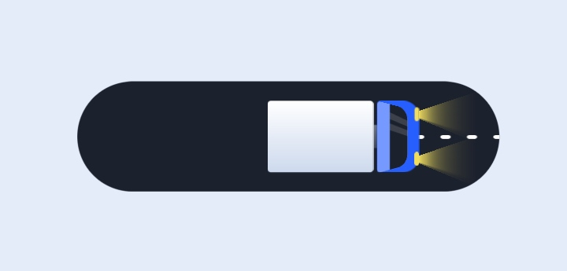

# Animated Confirmation Order

This project provides an animated confirmation order button with a truck animation. The order button transitions from "Complete Order" to "Order Placed" with a truck animation that offers a visually appealing confirmation experience.

## Demo
You can view the live demo [here](https://johndev19.github.io/Animated-Confirmation-Order/).

## Technologies Used
- HTML
- CSS
- JavaScript (jQuery)

## Installation
1. Clone this repository: `git clone [repository-url]`
2. Open the `index.html` file in your preferred browser.

## How to Use
1. Click the "Complete Order" button to trigger the animation.
2. Observe the transition to "Order Placed" along with the truck animation.

## Styling
The styling is defined in the `style.css` file, and the colors are set using CSS variables for easy customization.

## Animation Details
The animation utilizes CSS keyframes for the truck movement, door opening, box movement, and light flickering.

## Contribution
Feel free to contribute to this project by creating pull requests. Your contributions are highly welcomed!

## Credits
**Author:** JOHN RÉ PORAS

## License
This project is open-source and available under the [MIT License](LICENSE).

---
**Copyright (c) 2024 JOHN RÉ PORAS**
